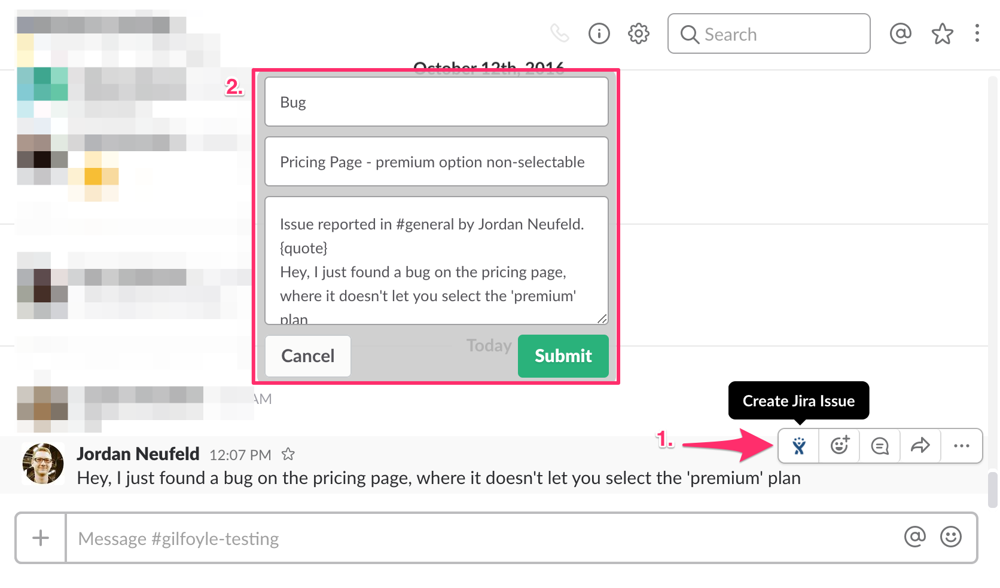

# userscripts
Collection of userscripts for the Tampermonkey browser extension

## How to use:
1. Add the Tampermonkey Extension to [Chrome](https://chrome.google.com/webstore/detail/tampermonkey/dhdgffkkebhmkfjojejmpbldmpobfkfo?hl=en) or [Firefox](https://addons.mozilla.org/en-US/firefox/addon/tampermonkey/)
2. Click on the script's `raw` url to install!


# The scripts

## [cat-news-network.user.js](https://raw.githubusercontent.com/neufeldtech/userscripts/master/cat-news-network.user.js)
This script adds a button to the www.cnn.com website that, when clicked, replaces all images on the page with images from www.thecatapi.com.


## [github-colorpicker.user.js](https://raw.githubusercontent.com/neufeldtech/userscripts/master/github-colorpicker.user.js)
This script adds functionality to github.com so that you can change the color of the navigation bar. Just install it, click on the profile dropdown menu, and you'll see a new option called `🎨 Change Color`.


## [slack-automoji.user.js](https://raw.githubusercontent.com/neufeldtech/userscripts/master/slack-automoji.user.js)
When installed, this script will automatically react with a 😁 grinning emoji to every message that someone sends while you have your Slack web-app open in your browser. Just install it, and change the `@match` directive to your team's Slack instance. If you're feeling brave, you can set it to ` // @match       https://*.slack.com/*` to match all Slack teams that you are on.

```
// @match        https://yourteamname.slack.com/*
```

## [slack-create-jira-issue.user.js](https://github.com/neufeldtech/userscripts/raw/master/slack-create-jira-issue.user.js)
This script is another example of how you can add functionality to the Slack web-app user interface. When installed, this script adds a button that allows you to create Jira tickets directly from Slack. If you want to use this script in your own environment, you'll need to update these settings:

```
// @namespace    *://yourteamslack.slack.com
// @match        *://yourteamslack.slack.com/*
// @connect      jira.yourwebsite.com
...
var jiraURL = "https://jira.yourwebsite.com";
```
